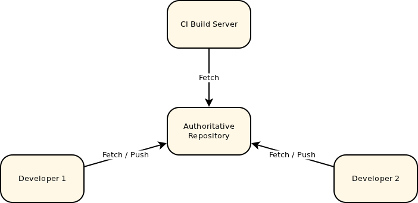
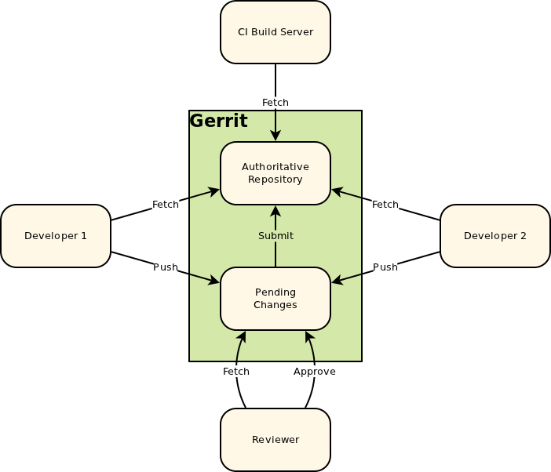
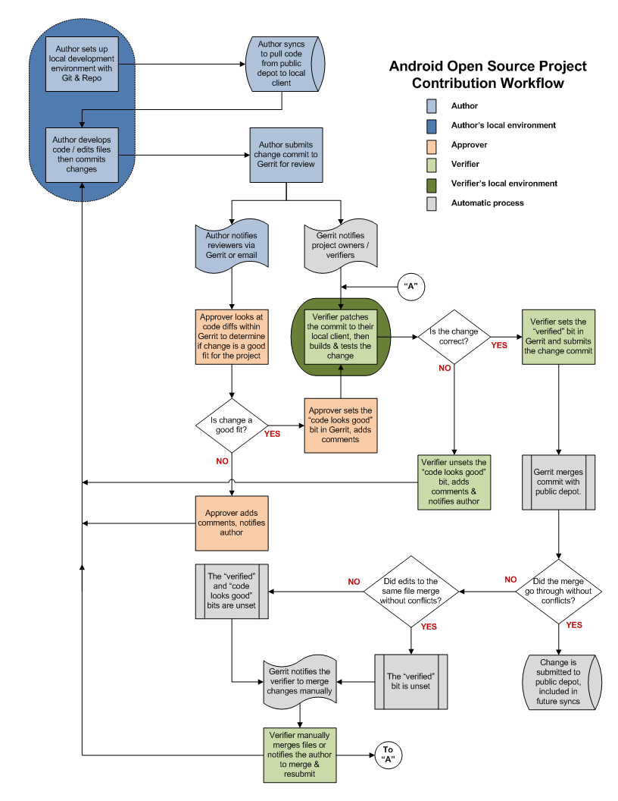

.. include:: <s5defs.txt>

=================
 Gerrit overview
=================

:Author: Yuriy Taraday
:Contact: yorik.sar@gmail.com; ytaraday@mirantis.com

.. container:: notes

    Outline should be:

    * Gerrit's place in the world
    * Gerrit data model and terminology
    * Gerrit change request lifetime
    * Big Workflow picture
    * How to use it with Git only
    * How to use git-review

Gerrit origins
==============

* Fork of Guido's Rietveld
* Named after Gerrit Rietveld
* Originally written in Python, moved to Java and GWT
* Incorporates Java-based Git server (based on JGit) and SSH (Mina SSH)
* Initially developed for Android, currently is used for a number of other
  opensource projects (CyanogenMod, OpenStack, etc)

.. container:: notes

    Forked because Guido didn't want to complicate Rietveld code with ACL stuff

    Gerrit Rietveld - Dutch architect Guido is fond of

    Apache Mina SSH daemon - some claim it's slow, but it looks like it's
    enough for entire Android community

Common collaboration scheme
===========================

.. container:: notes

    Even with distributed VCS, some authoritative repository is used, code
    review is done using feature branches and commiting to master branch with
    gate.

Gerrit collaboration scheme
===========================

.. container:: notes

    Gerrit manages authoritative repo, all changes are first stored in separate
    area for review and are merged to repo's branches only on successful
    review.

    Developers and CI infrustructure fetch code from that repo.

    Gerrit also provides very powerfull access control stuff.

Gerrit data model and terminology
=================================

.. class:: incremental

    * Project (Git repository)
    * Branch
    * Change request
    * Patchset (one and only commit)
    * Comment (+ inline comments)
    * Label (like +1)

.. container:: notes

    Project
      a big manageable piece, actually a single repo controlled by Gerrit

    Branch
      a branch in that repo that is visible to outer world

    Change request
      * can be though of as a branch but it's always a single commit changing
      * Has attributes like "status" (Review, Abandonned, Merged), "owner" (the
        one who pushed it first)
      * is tied to a specific branch of a specific project
      * change id is generated from commit's tree id, parent commit id,
        comitter and author 

    Patchset
      * represents one version of each change, requires constant amending
      * they are tied to change request by change-id in commit message, every
        new pushed commit becomes new change request otherwise
      * parent commit must be merged into the branch to let the patchset
        through

    Comment
      * anyone with access to the change can just write some comment or a
        number of inline comments and publish them
      * users with review rights can place their +-1 labels on the current
        patchset

Change request lifetime
=======================

.. container:: center tall

    .. dot:: images/change_request.svg

        digraph lifetime {
            height=800;
            bgcolor=transparent;
            created[label="Patch set 1 pushed"];
            { rank=same;
                abandon[label="Abandonned"];
                review[label="Everybody take a look"];
                complaint[label="Someone complains"];
            }
            fix[label="Someone fixes"];
            { rank=same;
                verified[label="Verify +1"];
                reviewed[label="Review +1"];
                approved[label="Review +2"];
            }
            lastdot[shape=point];
            merged[label="Submitted"];

            created -> review -> reviewed -> lastdot -> merged;
            review -> verified -> lastdot;
            review -> approved -> lastdot;
            abandon -> review [dir=back];
            review -> complaint;
            fix -> complaint[dir=back];
            fix -> review;
        }

.. container:: notes

    It's very simplified.

    * Someone pushes one's code to Gerrit, creates a new change
    * Now change is open for everyone to look at
    * Verifier (can be some Jenkins running unittests or QA engineer) can label
      it with Verifiy +1 or -1 labels
    * Anyone can give it a Review +1 or -1, these labels are only states of
      opinion.
    * Approver (core developer, dev manager or smth like that) can give it +2
      or -2.
    * Once change (current patchset) gathered Verify +1 and Review +2, it can
      be submitted to the branch.
    * If someone doesn't like something, one places a "-" label, so that
      everyone including the author can see that smth is wrong, fix it and push
      a new patchset.
    * If author gives up on pushing this change, one can abandon it.

Labels: Verified
================

.. class:: incremental

    * -1 Fails - smth is broken (persists, blocks submit)
    * 0 No score - I no QA, I know no tests
    * +1 Verified- code works (enables submit)

Labels: Review
==============

.. class:: incremental

    * -2 Do not submit - awful, unacceptable (persists, blocks submit)
    * -1 I would prefer you didn't submit this - I don't like it (but just an
      opinion)
    * 0 No score - I read code no
    * +1 LGTM, but someone else must approve - I like it, but can't or won't
      approve
    * +2 LGTM, approved - We'll merge it (enables submit)

Submit requirements
===================

* no "-1 Fails"
* no "-2 Do not submit"
* at least one "+1 Verified"
* at least one "+2 Approved"
* merged parent (dependency)

Big workflow picture
====================

.. container:: notes

    Picture shows workflow used by Android community.
    
    Basically everything's the same as at previous picture, but with more
    details

How to use it with Git
======================

.. class:: incremental

    * URL looks like: ``ssh://<USER>@<host>:29418/<PROJECT>``
    * Create a new change::

          git push gerrit HEAD:refs/for/thebranch

    * Fetch patchset (access later through FETCH_HEAD)::

          git fetch gerrit refs/changes/<ID_mod100>/<SHORT_ID>/<PATCHSET_NUM>

    * Create a new patchset in a change::

          git push gerrit HEAD:refs/change/<SHORT_ID>

    * You might even need to do something like this::

          git push gerrit HEAD:refs/for/master
                          HEAD~3:refs/changes/1500
                          HEAD~1:refs/changes/1501
                          HEAD~0:refs/changes/1502

.. container:: notes

    * It's better to create a remote for simpler usage
    * Gerrit will create a change request for every commit that is absent in
      branch and is not tied to any existing patchset.
    * Note that Gerrit will process all parents of HEAD as well
    * To avoid this, always use Change-Id line

Change-Id magic
===============

.. class:: incremental
    
    * Every change request has a long id that looks like 'I' + SHA
    * If it is in commit message, Gerrit will always treat this commit as a
      patchset for this change::

        Short commit description

        Some long lines about life, the Universe and everything.

        Change-Id: Ic0ffeec0ffeec0ffeec0ffeec0ffeec0ffeec0ff

    * Gerrit comes with a commit message hook that automatically generates
      Change-Id line in every commit::

        scp -p -P 29418 <USER>@<HOST>:hooks/commit-msg .git/hooks/
        curl -o .git/hooks/commit-msg http://<HOST>/tools/hooks/commit-msg

.. class:: notes
    
    * you can find Change ID of old change requests on their page
    * the hook generates ID from tree, author, commiter and first parent
    * with this hook you can always push to refs/for/master

Review process
==============

.. class:: center

    Short demo

.. container:: notes

    * Create a couple of commits
    * push them manually
    * show them in web
    * show diff, inline comments
    * show labels and big comments
    * how labels disapear
    * how they don't
    * finally submit

git-review utility
==================

.. class:: incremental

    Problems:

    * using plain Git with Gerrit is mouthfull
    * newcommers have to learn a lot to join project
    * number of steps are too common to be manual
    
    OpenStackers created git-review tool

    * install::

        pip install git-review

    * almost all you need is::

        git review

.. container:: notes

    OpenStack wanted to migrate to Gerrit, but it was too complex

    Internally git-review uses gerrit command line interface

git-review: config
==================

You should have .gitconfig file in repo to let every user benefit from
git-review ::

    [gerrit]
    host=gerrit.example.com
    port=29418
    project=myopenstack/keystone
    defaultremote=gerrit-myopenstak
    defaultbranch=longlived-branch

defaultremote allows to use one repo with several Gerrits (internal and
upstream)

defaultbranch leaves no place to forget where to push

.. container:: notes

    File should be created/edited by project/branch maintainer.

    Merges should not affect it.

    defaultbranch is pretty recent
    
git-review: workflow
====================

.. class:: incremental

    * clone repo
    * install commit_msg hook, and create remote ::

        git review -s

    * rebase on top of fresh upstream and push changes ::

        git review

    * list pending changes ::

        git review -l

    * get one of them to separate local branch ::

        git review -d <SHORT_ID>

    * more in help page

Conclusion
==========

.. class:: incremental

    * Gerrit is not as scary
    * Change-Id line saves a lot of nerve
    * git-review tool saves your time

The end
=======

.. class:: center

    Thanks!
    
    Slides are at http://yoriksar.github.com/gerrit-slides/
